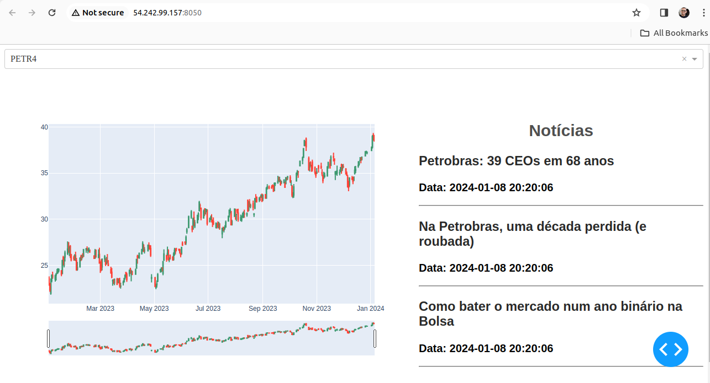

## Estrutura do Projeto

Neste projeto utilizo principalmente: **Python**, **Dash**, **Plotly**, **MySQL**, **Beaultiful Soup**, **Yahoo Finance**, **Brazil Journal** e **AWS**.

O projeto rodando pode ser encontrado em [Dash](http://54.242.99.157:8050/)

O cientista de dados é um profissional interdisciplinar ente matemática, estatísitica, negócio e computação. Além da ponta de negócio, vejo alguns estudantes e profissionais esquecendo de outra coisa fundamental: **computação**.

Muitas vezes limitam-se a saber o básico de python+pandas e só. Ao meu ver, o conhecimento em computação deve ir um pouco além. Não estou dizendo que o profissional de dados seja um engenheiro de software, mas é necessário compreender aspectos básicos de API, Arquitetura e Modelagem de DB.

Nesse projeto busquei explorar um pouco disso. Arquitetei a aplicação baseando-me no modelo **MVC**. A vantagem dessa arqutetura é a separação de responsabilidades. Cada parte da aplicação tem uma única atuação. Isso facilita, por exemplo, a manutenção do código.

Então temos um **Model** que é onde ocorre toda a interação com o banco de dados por meio do **SQLAlchemy**, temos o **Controller** que cuida das regras de negócio e recebe as "requisições" e temos a **View** que é o front da nossa aplicação.

### Os Diretórios do Projeto
1. No diretório **db** se encontram o arquivo de conexão com o banco de dados, o **Model** do projeto e um código para popular o banco inicialmente.
2. No diretório **Controller** estão os controllers da aplicação que cuidam das regras de negócio.

### O banco de dados
Utilizei **MySQL** e modelei as tabelas utilizando o modelo *fato-dimensão*. Então tenho uma tabela "dim_company" que tem os dados das companhias, tenho uma tabela "fat_news" que contém as notícias relacionadas a uma dada companhia e a tabela "fat_stocks" que apresenta as cotações de uma determinada companhia.

## Como executar
O projeto é bem simples de rodar. Vale salientar que estou utilizando **MySQL** então é preciso ter um servidor de banco de dados instalado. Após instalar, crie um banco de dados (no projeto criei um *psel_varos*) e modifique o arquivo "db/connector.py" com as suas credenciais (vale salientar que o ideal é deixar as credenciais em um arquivo separado e não subir para o repositório).

Uma vez tendo o banco de dados, basta rodar o arquivo "db/model.py" para estruturar as tabelas e depois rodar "db/initial_populate.py" para preencher as tabelas com os dados iniciais.

Agora é só executar o "main.py".

## Como funciona
Basicamente, 
1. O dash solicita os dados de cotação e notícia aos Controllers
2. Os Controllers, por sua vez, verificam se têm os dados mais atualizados no banco de dados e retornam para o dash.

   1. Caso não tenham os dados atualizados, eles buscam (no Yahoo Finance e no Brazil Journal) os dados, atualizam
   as tabelas e devolvem ao dash.
   
   2. Caso não tenham dados nenhum, eles buscam (no Yahoo Finance e no Brazil Journal) os dados, populam as tabelas e devolvem ao dash.
